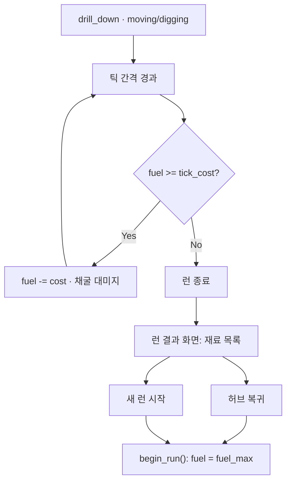

# 연료 시스템 설계

Godot 4 · `Dig Down the Planet`  
이 문서는 **채굴 틱마다 연료를 소모**하는 규칙, 스탯·공식, 런 종료·HUD까지 정리한다.

관련 코드: `scripts/player/Drill.gd`, `autoload/StatSystem.gd`, `scenes/main/Main.gd` (깊이 HUD)  
관련 문서: [`FUEL_SYSTEM_IMPLEMENTATION_PLAN.md`](FUEL_SYSTEM_IMPLEMENTATION_PLAN.md) (단계별 구현), `MVP_DEVELOPMENT_PLAN.md`, `SKILL_TREE_DESIGN.md`

---

## 1. 확정 사항 (요약)

| 항목 | 결정 |
|------|------|
| 소모 단위 | **`fuel_cost_per_mine_tick`** (채굴 틱 1회당). `fuel_drain_per_second` 폐기 |
| 소모 조건 | **`moving` / `digging`**일 때 틱마다 1회 (`idle` 없음) |
| 비용 공식 | **덧셈:** `tick_cost = cost_base + cost_depth` |
| 연료 고갈 | **런 종료** → 이번 런 재료 정산 화면 → 허브 복귀 또는 새 런 |
| 연료 리필 | **모든 런 진입 시 항상 풀탱크** (시작·허브 복귀·사망/포기 후 재시작 동일) |
| 초기 밸런스 | `fuel_max = 10`, `fuel_cost_per_mine_tick = 2.0`, `mine_tick_interval = 1.0` → 업그레이드 없이 **약 5틱·5초 내외** 짧은 런 |
| 깊이 추가 비용 | **구간 테이블** (`FuelDepthCost`) |
| HUD | **게이지 + 숫자** (`fuel` / `fuel_max`) |

---

## 2. 런 종료·리필·허브 (기획 확정)

### 2-1. 연료 고갈 = 런 종료

연료가 다음 틱 비용을 낼 수 없을 때(또는 `fuel`이 0 이하):

1. 채굴·`drill_down` 진행 중단
2. **런 종료** 처리 (일시정지 또는 입력 잠금)
3. **런 결과 화면** 표시 — 이번 런에서 획득한 재료 목록
4. 플레이어 선택:
   - **허브로 돌아가기**
   - **새 런 시작** (다시 Main 등 채굴 씬)

사망·포기 버튼 등 다른 런 종료 경로도 **동일한 결과 화면**으로 합칠지는 구현 시 통일 권장.

### 2-2. 연료 리필 — 한 가지 규칙으로 통합

| 상황 | `fuel` |
|------|--------|
| 런 **시작** (허브에서 출발) | `StatSystem.get_final(&"fuel_max")` |
| 런 결과 화면 → **새 런** | 동일 (풀탱크) |
| 런 결과 화면 → **허브 복귀** 후 다시 출발 | 동일 (풀탱크) |
| 런 중 **사망 / 포기** 후 재시작 | 동일 (풀탱크) |

**런 중에는 `fuel`을 세이브하지 않는다.** 다음 런은 항상 위 식으로 초기화.

> **2번(런 시작)과 3번(허브 복귀)이 비슷한 이유**  
> 플레이 관점에서는 “허브에서 나갈 때마다 / 다시 들어갈 때마다 탱크가 가득 찬다”는 **한 문장**으로 충분하다.  
> - **런 시작** = 채굴 씬에 들어가는 순간  
> - **허브 복귀** = 허브에만 있을 때는 연료 UI가 없거나 무의미하고, **다음 런을 시작할 때** 다시 풀탱크  
> 구현은 `begin_run()` 한 곳에서 `fuel = get_final(fuel_max)`만 호출하면 2·3·4를 모두 만족한다.

---

## 3. 용어·스탯

### 3-1. 런타임 (`Drill.gd`)

| 이름 | 의미 |
|------|------|
| `fuel` | 현재 연료 (런 중만 유효) |
| `fuel_max` | 최대 연료 (`StatSystem` 최종값) |

### 3-2. 스탯 ID

| stat_id | 의미 | **기본값 (확정)** | 비고 |
|---------|------|------------------:|------|
| `fuel_cost_per_mine_tick` | 틱당 연료 | **2.0** | 스킬 덧셈. 효율은 음수 |
| `fuel_max` | 최대 연료 | **10.0** | 스킬로 상한 성장 |
| `mine_tick_interval` | 틱 **간격(초)** | **1.0** | §7 참고 |
| ~~`fuel_drain_per_second`~~ | — | — | 폐기 |

틱 비용 하한: `tick_cost = maxf(cost_base + cost_depth, 0.0)` (0 틱 무료 채굴 방지).

### 3-3. 초기 밸런스 검산 (업그레이드 0)

| 가정 | 값 |
|------|-----|
| `fuel_max` | 10 |
| `fuel_cost_per_mine_tick` | 2.0 |
| `cost_depth` (표면) | 0 |
| 가능 틱 수 | 10 ÷ 2 = **5틱** |
| `mine_tick_interval` | 1.0초 → 홀드 채굴만 기준 **약 5초** (5틱) |

의도: 첫 런은 **흙 몇 칸**만 캐고 연료 고갈 → 결과 화면. `fuel_max`·효율·틱 주기 스킬로 런 길이 확장.

---

## 4. 틱당 연료 비용 (덧셈)

```
tick_cost = cost_base + cost_depth
```

| 항목 | 계산 |
|------|------|
| `cost_base` | `StatSystem.get_final(&"fuel_cost_per_mine_tick")` |
| `cost_depth` | `FuelDepthCost.get_additive(depth_m)` — **구간 테이블** |

```
depth_m = get_tip_global_position().y / TILE_SIZE_PX   # TILE_SIZE_PX = 32
```

### 4-1. 깊이 테이블 (초안 — 밸런스는 플레이테스트)

| depth_m 하한 | `cost_depth` (틱당 추가) |
|-------------:|-------------------------:|
| 0 | 0 |
| 50 | 0.5 |
| 100 | 1.0 |
| 200 | 2.0 |

적용: `depth_m` 이상인 **가장 큰 하한** 행. 데이터: `resources/balance/fuel_depth_cost.tres` (+ `FuelDepthCost.gd`).

초반(10 연료·5틱)에는 표면 `cost_depth = 0`만 체감 → 깊이 패널티는 중반 이후 스킬 성장과 함께 활성화.

---

## 5. 소모 시점·고갈 처리

### 5-1. 채굴 틱

- `idle` → 틱 없음, 연료 없음
- `moving` / `digging` → `mine_tick_interval`마다 틱 (대미지 + 연료)

### 5-2. 틱 1회 순서

1. `tick_cost` 계산
2. `fuel >= tick_cost` → `fuel -= tick_cost` → `apply_mine_damage_at_world`
3. `fuel < tick_cost` → **`end_run_fuel_depleted()`** (런 종료·결과 화면). 부분 차감 없음



### 5-3. `moving`에서도 소모

빈 공간 통과 시에도 틱·연료 소모 (확정). 짧은 초기 런에서도 “홀드하는 시간”이 연료를 깎는다.

---

## 6. 런 결과 화면 (신규 UI·플로우)

| 요소 | 내용 |
|------|------|
| 표시 | 이번 런 인벤토리 / 획득 재료 (기존 런 인벤 시스템과 연동) |
| 버튼 | **허브로**, **다시 채굴**(새 런) |
| 연료 | 이 화면에서는 연료 표시 불필요. 다음 `begin_run()`에서 풀탱크 |

구현 후보: `scenes/ui/RunResultScreen.tscn`, `GameRoot` 또는 `Main`에서 종료 신호 수신.

---

## 7. `mine_tick_interval` — 기획·표현 (§6번 고민)

### 7-1. 코드·스탯 (현재 유지 권장)

- 내부 stat_id: **`mine_tick_interval`** = 틱 **사이 시간(초)**. 값이 **작을수록** 채굴이 빨라짐.
- `Drill._process_mining_tick`: `accum += delta` 후 `interval`마다 1틱 (이미 구현된 패턴).

초기 목표 **약 5초·5틱**이면 `mine_tick_interval = 1.0`과 `fuel_max=10`, `cost=2`가 맞다. (런을 더 길게 하려면 `fuel_max`·`fuel_cost`·깊이 테이블을 조정.)

### 7-2. “2초에 1틱” vs “1초에 N틱”

| 관점 | `mine_tick_interval` (초/틱) | `mine_ticks_per_second` (틱/초) |
|------|------------------------------|----------------------------------|
| 구현 | ✅ 누적 타이머와 직결 | interval = `1 / tps` 변환 필요 |
| 스킬 표기 | “간격 −0.2초” (직관이 약함) | “초당 채굴 +0.5” (**업그레이드 느낌에 유리**) |
| 연료 밸런스 | interval↓ → 같은 연료로 **틱 수↑** → **더 빨리 고갈** | 동일 수학 관계 |

**권장:**

1. **시뮬레이션·StatSystem·CSV**는 계속 `mine_tick_interval` (초) 사용.  
2. **스킬 설명·UI**만 `ticks_per_sec = 1.0 / mine_tick_interval`로 보여 주기 (표시 전용, stat 추가는 선택).  
3. 스킬이 interval을 깎을 때 **연료·대미지 틱 수가 같이 늘어남**을 밸런스 표에 항상 같이 둔다.

별도 stat `mine_ticks_per_second`를 도입하려면 스킬은 tps에 **양수** 보너스, 런타임에서 `interval = 1 / get_final(tps)`로 환산 — Phase 2.

### 7-3. 연료와의 관계 (확정 인지)

- 연료 소모는 **틱 횟수**에 비례.  
- 채굴 속도 업( interval 감소 ) = 같은 10초에 **더 많은 틱** = **연료 더 빨리 소진**.  
- “빨리 캔다”와 “오래 버틴다”는 **`fuel_max` / `fuel_cost` / `mine_tick_interval` 스킬을 분리**해 조절.

---

## 8. HUD·디버그

### 8-1. 플레이어 HUD (확정)

| UI | 내용 |
|----|------|
| **게이지** | `fuel / fuel_max` 비율 (ProgressBar 등) |
| **숫자** | 예: `7 / 10` (정수 표시 권장) |

위치: Main `UILayer` 또는 전용 FuelPanel. 연료 부족 시 게이지 색 변경은 추후.

### 8-2. 디버그 (개발용)

| 항목 | 내용 |
|------|------|
| `tick_cost` | `cost_base + cost_depth` |
| 분해 | `base`, `depth` |
| 틱 간격 | `mine_tick_interval` 또는 `1/interval` tps |

---

## 9. 코드 배치

| 파일 | 역할 |
|------|------|
| `Drill.gd` | `fuel`, 틱 소모, 고갈 시 런 종료 신호 |
| `FuelDepthCost.gd` + `fuel_depth_cost.tres` | 깊이 테이블 |
| `StatSystem.gd` | 기본값 10 / 2.0, `fuel_drain_per_second` 제거 |
| `RunResultScreen` (신규) | 재료 표기, 허브/재시작 |
| `GameRoot` / `Main` | `begin_run()`, 종료 플로우 |
| `Main.gd` HUD | 연료 게이지 + 라벨 |

---

## 10. 스킬 방향 (초기 밸런스 이후)

| 스킬 (예) | stat | 방향 |
|-----------|------|------|
| `drill_fuel` | `fuel_max` | +N / 레벨 — 런 길이 |
| `drill_fuel_efficiency` | `fuel_cost_per_mine_tick` | 음수 — 틱당 소모 감소 |
| 채굴 속도 | `mine_tick_interval` | 음수(간격 감소) — 빠르지만 연료 틱 수 증가 |
| `drill_overdrive` (가정) | `fuel_cost_per_mine_tick` | 양수 — 공격 트레이드오프 |

`drill_fuel` 예시 수치는 `+20`이 아니라 **초기 10 기준**으로 재조정 (예: +5/레벨).

---

## 11. 구현

단계별 작업(1단계 = 1파일, HUD는 3~4단계에서 선행)은 **[`FUEL_SYSTEM_IMPLEMENTATION_PLAN.md`](FUEL_SYSTEM_IMPLEMENTATION_PLAN.md)** 를 따른다.

---

## 12. 추후 확장

- 곱셈형 연료·깊이 배율
- `moving`만 / `digging`만 소모 분리
- 허브 연료 충전 UI (현재는 런마다 풀충전만)
- `mine_ticks_per_second` stat 분리 (기획상 **미도입**, interval만 유지)
